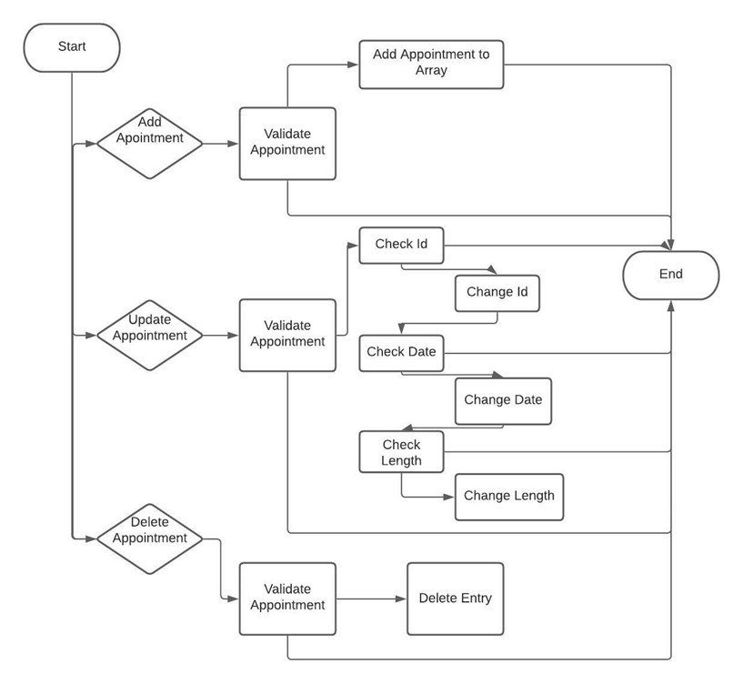
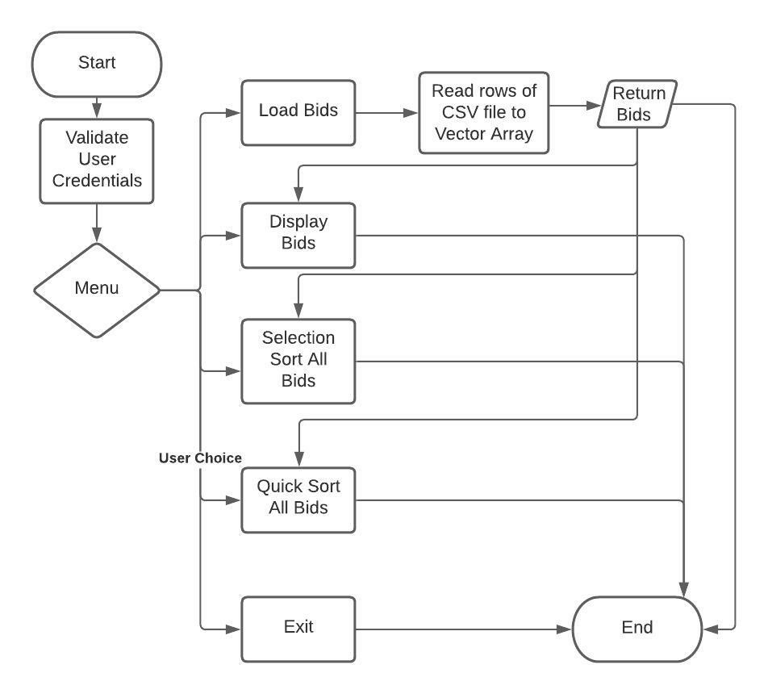
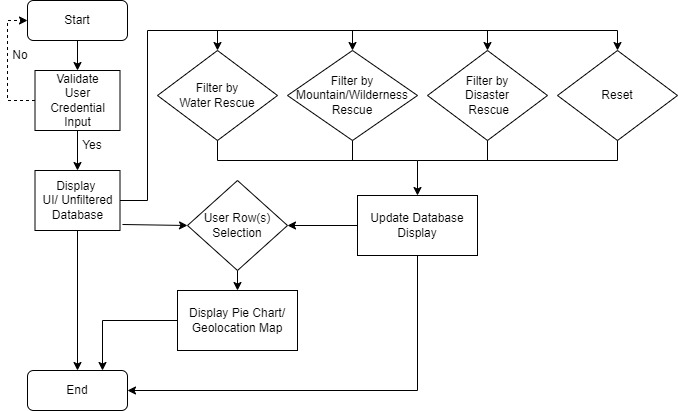

## Code Review

<iframe 
    width="560" 
    height="315" 
    src="https://www.youtube.com/embed/8yjHx4EzYJs" 
    frameborder="0" 
    allow="autoplay; encrypted-media" 
    allowfullscreen=""> 
</iframe>

## Refinement Plan Summary

### Artifact I: Software Engineering/Design

This first artifact is from my CS-320 course and includes implementation of a constructor and array design through Java. It also includes the utilization of Junit testing. This artifact also aligns with the key area of data structures with it’s use of arrays however the inclusion of unit testing examples aligns best with software engineering and design as paired testing is essential to the design process. I will look to enhance/refine my work through utilization of best practices in name conventions, code commenting, and structure. I will look to transfer the code into python for the sake of this project. 
#### Flowchart:

### Artifact II: Algorithms & Data Structures

My second artifact is a vector array with sorting capabilities. The artifact is from my CS-260 course here at SNHU. It aligns with the algorithm and data structures in that the code takes input and utilizes functions to solve the problem of searching and sorting data which is the definition of a program algorithm. Planned enhancement for this artifact is cleanup of structure, comment best practices and to make code more modular. By enhancing the code in this way will make it more efficient and easier to modify at a later time if needed.
#### Flowchart:

### Artifact III: Databases

The third artifact is a MongoDB database object/collection and a CRUD operation along with a JupyterDash dashboard to access and display database. This artifact perfectly aligns to this category as it all centers around databases and their modification/control. It is from my CS-340 course here at SNHU. Enhancement/refinement will include revising naming standards, coding best practices, and adding as much security to code as necessary. I will also look to include a MongoDB interface in order to access the information.
#### Flowchart:

**ePortfolio Links**   

* [Artifact I](ArtifactOne.md)
* [Artifact II](ArtifactTwo.md)
* [Artifact III](ArtifactThree.md)
* [Home](index.md)
